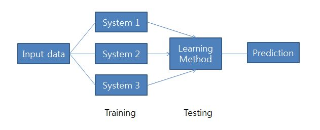
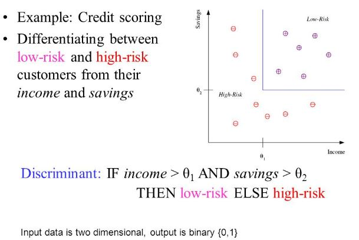
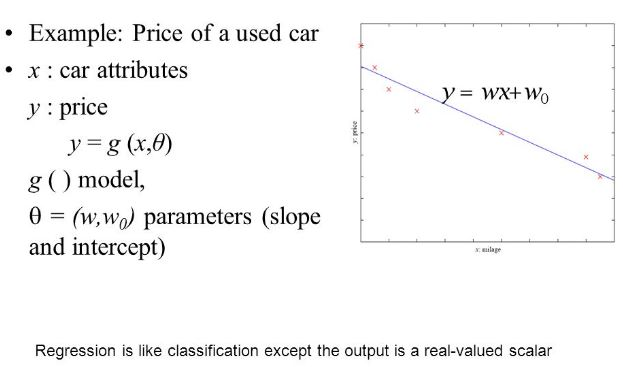
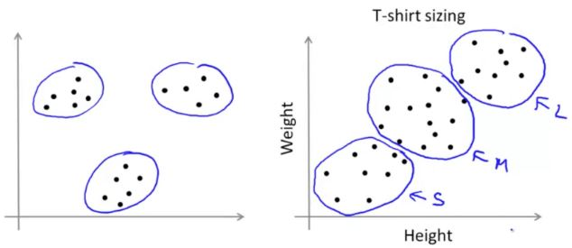

## Machine Learning
- "Machine learning refers to a system capable of the autonomous acquisition and integration of knowledge."
    + "LEarning denotes changes in a system that ... enable a system to do the same task ... more efficiently the next time." - Herbert Simon

## What is Machine Learning?
- There is no need to "learn" to calculate "average"

- Machine Learning
    + Study of algorithmns that
    + improve their performance
    + at some task
    + with experience
    
- Optimize a performance criterion using example data or past experience

- Data is cheap and abundant (data warehouses, data marts); knowledge is expensive and scarce

## Learning System model 

  

## Why Machine Learning?
- No human experts
    + industrial/manufacturing control
    + mass spectrometer analysis, drug design, astronomic discovery
- Black-box human expertise
    + face/handwriting/speech recognition
    + driving a car, flying a plane
- Rapidly changing phenomena
    + credit scoring, financcial modeling
    + diagnosis, fraud detection
- Need for customization/personalization
    + personalized news reader
    + movie/book recommendation
    
## Data Mining
- "Data Mining is a process of identifying valid, novel, potentially useful, and ultimately understandable patterns in data" (Fayyad)

- Applications
    + Retail: Market basket analysis, Customer relationship management (CRM)
    + Finance: Credit scoring, fraud detection
    + Manufacturing: Optimization, troubleshooting
    + Medicine: Medical diagnosis
    + Telecommunications : Quality of service optimization
    + Bioinformatics: Motifs, alignment
    + Web mining: Search engines

## Process of Analytics
1. Selection : Obtain data from various sources
2. Preprocessing: Cleanse data
3. Transformation: Convert to common format. Transform to new format.
4. Machine Learning/Data Mining : Obtain desired results.
5. Interpretation/Evaluation : Present results to user in meaningul manner

## Machine Learning Tasks
- Association Analysis
- Supervised Learning
    + Classification
    + Regression/Prediction
- Unsupervised Learning
- Reinforcement Learning
    + Decision making (robot, chess machine)
- Deep Learning

### Association Analysis
- Identify relationships among values in data
- Can be applied if no class is specified and any kind of structure is considered interesting
- Association discovery
    + Rule about items that appear together
    + E.g. Purchase transaction  
      - if people buy a hammer then they buy nails  
      - on Thursday night, if people buy beers then they buy diapers
- Also called market-basket analysis    
   
- $P(Y|X)$ probability that somebody who buys X also buys Y where X and Y are products/services
    + Example : P(chips|beer) = 0.7
    
<Market-Basket transcations>

|TID|Items|
|---|:---|
|1| Bread, Milk |
|2| Bread, Diaper, Beer, Eggs |
|3| Milk, Diaper, Beer, Coke | 
|4| Bread, Milk, Diaper, Beer |
|5| Bread, Milk, Diaper, Coke |

### Supervised Learning
- Classification : Y 변수가 분류형
- Regression : Y 변수가 연속형 (double)

### Classification
- Predictive modeling for categorical or discrete values (or class)
- Classification learning is supervised
- Identify the group to which each case belongs, for example,
    + likely to respond to a direct mail solicitation
    + vulnerable to switching to a competing long-distance phone service
    + good candidates for a surgical procedure
    + Good or bad credit risk
    

  
    
### Regression
- Predictive modeling for continuous values
- Standard technique : linear regression
- Complex structures of multiple predictor vatiables
    + GAM (generalized additive model)
    + MARS
    + Regression Tree (CART, GUIDE)
    + Neural Networks (S-plus, MATLAB)
- Non-gaussian case : GLM (generalized linear model)
- Success is measured on a fresh data

  
  
### Unsupervised Learning
- Finding groups of items (observations) that are similar
- Divide data into different groups
- Groups are not previously defined - unsupervised
- Must interpret the clusters
- Hierachical clustering, K-means clustering, model-based clustering, Kohonen feature maps

  

## Applications

#### 1. E-commerce
- Recommendations for purchases
- Customers who bought this book also bought :
    + 100 Questions Every First-Time Home Buyer Should Ask
    + How to Save Thousands of Dollars on Your Home Mortgage
    + Home Buying for Dummies
    + Mortgages For Dummies

#### 2. Retailers
- Which product to stock in particular stores
- How to place them within a store
- Customized promotions and coupons to shoppers
- Assess the effectiveness of promotions and coupons

#### 3. Credit Scoring
- Cases: Past applicants
- Inputs: Application information, credit bureau reports
- Target: Default, charge-off, serious delinquency, repossession, foreclosure
- Action: Accept or reject future applicants for credit

#### 4. Target Marketing
- Cases: Customers, prospects, suspects, households
- Inputs: Geo/demo/psycho-graphics, RFM(recency, frequency, monetary)
- Target: Response to a past or test solicitation
- Action: Target high-responding segments of customers in future campaigns

#### 5. Customer Relationship Management
- Cases: Existing customers
- Inputs: Payment history, product/service usage, demographics
- Target: Churn, brand-switching, cancellation, defection
- Action: Customer loyalty promotion
    
#### 6. Fraud Detection
- Cases: Past transaction or claims
- Inputs: Particulars and dircumstances
- Target: Fraud, abuse, deception
- Action: Impede or investigate suspicious cases
    
#### 7. Insurance Application
- Claims forecasting
    + Which customers are likely to have claims next year?
    + What is the risk potential of a policy holder?
- Agent profiling
    + What are the characteristics of profitable agents?
    + Who are the agents likely to have compliance problems?
    
#### 8. Medical Applications
- Who are good candidates for surgery?
- Who are at risk for certain disease?
- Filtering CT images for further examination
- Which tests/procedures/medications are ineffective?
- What combinations of tests are most effective?
    
#### 9. Pharmaceutical Applications
- Clinical trial databases
    + Who is likely to be non-compliant or drop out?
    + Find individuals most susceptible to placebo effect
- Genomics
    + Associate genes with diseases
    + Find agent for development for the treatment of disease
    + Find relationships between genotype and drug response
    
#### 10. Face Recognition
- Training examples of a person
- Test images