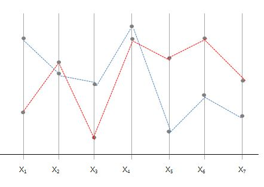

## Data Pre-processing
- Data preparation take most of the time in Big Data Analytics
    + Objectives determination : 22%
    + Data Preperation : 56%
    + Data Mining : 12%
    + Analysis and ASsimilation : 10%

## Dummy Variables 
- 어떤 값이 범주형 값일 수 있음 (예: 거주하고 있는 지역)

X | | Da | Db | Dc | ...
--|---|---|---|---|---
D |  | 0 | 0 | 0 | ...
B |  | 0 | 1 | 0 | ...
C |  | 0 | 0 | 1 | ...
C | -> | 0 | 0 | 1 | ...
A |  | 1 | 0 | 0 | ...
A |  | 1 | 0 | 0 | ...
D | | 0 | 0 | 0 | ...
...|   |   |   |   | ...


```{r Dummy variable}
### Dummy variable ### 
#install.packages("dummies", repos="http://healthstat.snu.ac.kr/CRAN/")
library(dummies)
data( iris )
head(iris, 10)
d <- dummy.data.frame( iris )
head(d)
iris$Ind1 <- as.numeric(iris$Species == 'setosa')
iris$Ind2 <- as.numeric(iris$Species == 'versicolor')
head(iris)
```

## Data Arrangement
< Long-Narrow >

| Acct | type |
| -----| -----|
| 2133 | MTG  |
| 2133 | SVG  |
| 2133 | CK   |
| 2653 | CK   |
| 2653 | SVG  |
| 3544 | CK   |
| 3544 | MMF  |
| 3544 | CD   |
| 3544 | LOC  |

< Short-Wide >

| Acct | CL | SVG | MMF | CD | LOC | MTG |
| ---- | --- | --- | --- | -- | --- | --- |
| 2133 | 1 | 1 | 0 | 0 | 0 | 1 |
| 2653 | 1 | 1 | 0 | 0 | 0 | 0 |
| 3544 | 1 | 0 | 1 | 1 | 1 | 1 |

## Missing Value Imputation

## Imputation Methods
- Substitutaion with a measure of **central tendency**
    + 평균 : Missing value는 평균으로 대체 (평균의 함정, outlier 왜곡 가능성 있음)
    1) Trimmed Mean (절사 평균) : 양 극단 5% 제외 등 
    2) Mid-minimum spacing <br/>
       - P percent of the data is trimmed from each tail of the distribution <br/>
       - From the trimmed distribution, $(Max + Min)/2$
- Distribution based
- Tree Imputation
- **Regression Imputation**
- Imputation using the EM algorithm
- Multiple Imputation 

```{r Imputation}
#install.packages("Hmisc", repos="http://cran.nexr.com")
library(Hmisc)
age <- c(1,2,NA,4)
age.i <- impute(age) # default = median value
# Could have used impute(age,2.5), impute(age,mean), impute(age,"random")
age.i
summary(age.i)
is.imputed(age.i)
```


## Outlier Replacement
- 하한 값과 상한 값을 결정한 후,
- 어떤 값이 하한 값보다 적으면 하한 값으로 대체함
- 어떤 값이 상한 값보다 크면 상한 값으로 대체함

- 평균의 표준편차
    + 하한 값 = 평균 - n*표준편차
    + 상한 값 = 평균 + n*표준편차
    + n은 임계치 옵션에서 변경 가능함 (default는 3)
  
- 평균절대편차 
    + 중위수로부터 n편차 큰 값을 대체
- 극 백분위수 (extreme percentiles) 
    + 상위 p번째 백분위수보다 큰 값을 대체


## Variable Transformation
- 적절히 변환된 변수
    + 모형의 예측력 향상에 기여 가능
    + (예) 규모대비 매출액 : X10 = 매출, X11 = 규모  --> X10/X11 = X*10 
- 변환의 종류 
    + 자연로그 $Y = log(X)$
    + 제곱근 $Y = \sqrt{x}$
    + 역 $Y= 1/X$
    + 제곱 $Y = X^{2}$
    + 지수 $Y = EXP(X) = e^{X}$
    + 표준화 $Y = \frac{(X-μ)}{σ}$

## Example
#### HMEQ dataset
| 범주 | 변수이름 | 변수내용 |
|------|----------|----------|
| 목표변수(=Y) | BAD | 신용상태0(좋음), 1(나쁨) |
| 대출신청서 | REASON | 대출사유 (빚정리, 주택개량) |
| | JOB | 직업의 종류 (6개 범주) |
| | LOAN | 대출금액 |
| | MORTDUE | 저당금액 |
| | VALUE | 현재 자산 |
| | DEBTINC | 수입 대 부채비율(DTI) |
| | YOJ | 현 직장 근무년수
| 신용정보기관 | DEROG | 주요 부실거래 수
| | CLNO | 금융거래 수 |
| | DELINQ | 부실거래 수 |
| | CLAGE | 가장 오래된 거래의 개월 수 |
| | NIMQ | 최근 신용상태 조회수 |

```{r HMEQ data}
### HMEQ data ### 
#setwd("D:/jupyter/DataScience/ML")
hmeq<-read.table("./DMdata/hmeq.txt",header=T,sep='\t')
head(hmeq,10)
levels(hmeq$REASON)[levels(hmeq$REASON)==""]<-NA
levels(hmeq$JOB)[levels(hmeq$JOB)==""]<-NA
head(hmeq,10)
hmeq$BAD<-factor(hmeq$BAD) #BAD를 범주형 변수로 변환 (기존 integer 정수)
class(hmeq$BAD)

hist(hmeq$VALUE)
boxplot(hmeq$VALUE)
hmeq$logVALUE=log(hmeq$VALUE)
hist(hmeq$logVALUE)
```


## R example
```{r Basic R functions}
## Basic R functions ##
table(hmeq$REASON, hmeq$JOB)
# dataframe 이름이 길경우 유용 (위의 명령어와 동일 결과)
with(hmeq, table(REASON, JOB))  

with(hmeq, table(REASON, JOB, useNA = "ifany"))
with(hmeq, table(REASON, JOB, exclude = "Other"))

# 직업의 종류와 대출 사유는 무관하지 않다는 것을 볼 수 있음 (p-value = 0.004576 < 0.05)
chisq.test(table(hmeq$REASON, hmeq$BAD)) 
# 면적의 비율을 비교하여 관련성을 시각화
mosaicplot(~BAD+REASON, data=hmeq) 
```

## R plotting

```{r R plotting}
# 직업의 종류 별로 bar chart를 생성 
plot(hmeq$JOB) 
# 직업의 종류 별로 빈도수를 구해서 pie chart를 생성
pie(table(hmeq$JOB))

# 하나는 범주형(BAD), 하나는 연속형 변수(DEBTINC) 일 경우 Box plot이 생성됨  
# 불량 고객의 경우 소득대비 부채 비율이 높음 (subset으로 DEBTINC 75 이하만 보는 조건 )
plot(hmeq$BAD,hmeq$DEBTINC, subset=hmeq$DEBTINC<75)
# 위의 결과와 동일한 plot 
plot(~BAD+DEBTINC, subset=DEBTINC<75, data=hmeq)

hist(hmeq$VALUE, breaks=50, freq=F, xlim=c(8000,300000))
hist(hmeq$VALUE, breaks=50, freq=F)#, xlim=c(8000,300000))
lines(density(hmeq$VALUE, na.rm=T), col='blue')

plot(~LOAN+VALUE+MORTDUE+YOJ+DEBTINC, data=hmeq, cex=0.1) # default size = 1 (cex를 통해 점의 크기를 0.1로 조정)
plot(~LOAN+VALUE+MORTDUE+YOJ+DEBTINC, data=hmeq, cex=0.1, subset = VALUE<300000, main="VALUE < 300000")

#log=1:3 ==> make 1:3 variables to log scale (LOAN, VALUE, MORTDUE 세개 변수는 log를 취해서 차트를 생성)
# (예) Value 와 Mortdue는 강한 선형 관계를 가지므로, 둘 중에 하나를 쓰거나 둘을 결합한 형태의 변수를 쓰는 것이 좋음
plot(~LOAN+VALUE+MORTDUE+YOJ+DEBTINC, data=hmeq, cex=0.1, subset = VALUE<300000, log=1:3, main="Log scale")

require(MASS)
color=rep('green',nrow(hmeq)) # rep=반복
color[hmeq$BAD==1]='red' # BAD=1(불량고객에 해당되는 경우 RED로 변경)

# parcoord: parallel coordinate(수평축) 
# lwd=line width, lty=line type (점선 or 실선.. etc)
parcoord(hmeq[,c('LOAN','VALUE','MORTDUE','CLAGE','DEBTINC')],col=color,lwd=0.001,lty=3)
```

#### Parallel Coordinate 차트의 이해 
- 다변량 그래프로 변수별로 Y변수의 패턴이 다른지를 확인할 수 있
- X1, X2, ..., X7 - 각 X변수에 대한 Y 값을 표현해주고, 그 값을 라인으로 연결


```{r Star Plot}
# 개별 고객 한명한명에 대한 star plot 
# 0은 우량고객(Red), 1은 불량고객(Black)
stars(hmeq[1:18,c('LOAN','VALUE','MORTDUE','CLAGE','DEBTINC')],col.stars=hmeq$BAD,key.loc=c(11, 2),ncol=5)

```


