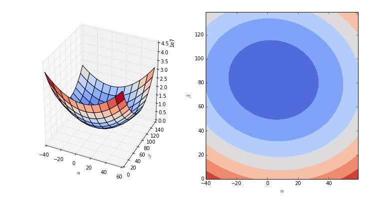

## Notation
- Input variables : $x = (x_{1}, ..., x_{p}), x=\mathbb{R}^{p}$
- Response variable : $y = \mathbb{R}$
- Experimental unit (obsercation) : $1,\cdots, m$
- Data matrix

$x = \begin{bmatrix} x_{11'} & \cdots & {x_{1p}} \\ \vdots & \ddots & \\ x_{m1'} & \cdots & x_{mp} \end{bmatrix} = \begin{bmatrix} x_{ij} \end{bmatrix}, \left\{\begin{matrix} i = 1, \cdots , m \\j = 1, \cdots , p \end{matrix}\right.$ 
  

## What are we seeking?
- **Supervised: Low E-out or maximize probabilistic terms**
- y를 예측하는 hΘ=(Xi) E-out 을 최소화 하는 모델을 찾는 개념

- Unsupervised: Minimum distance, MLE(maximun likelihood estimation)

  

- $d_{vc}$ : Vapnik-Chervonenkis Dimension
    + Vapnik이 만든 기법으로 모델이 복잡해질 수록 $d_{vc}$ 값이 커짐
    + training data는 아웃라이어까지 맞추는 모습 (위 그림의 녹색 라인)
    + (위 그림의) 점선이 test data에 해당하는 최적의 모델  
- **Under-fitting : 과소적합**
- **Over-fitting : 과대적합** (outlier 까지 fitting 을 함) 
    + Deep learing 을 하다보면 overfitting 하기 쉬움
    
    
## Two Cultures
- Parametric approach (통계학)
    + 모형식을 세우고 식 내의 모수를 데이터를 활용하여 구하는 방식
    + 결과의 해석이 용이, 결과가 복잡하지 않음
    + 가정이나 설정한 식에 부합되지 않은 데이터의 경우, 성능이 낮음
    + Regression, Logistic Regression
- Algorithm approach (전산과학)
    + 정해진 방식, 즉 알고리즘에 의해 데이터로 학습
    + 데이터의 복잡성이 높아도 적용 가능
    + Overfitting이 있을 수 있으며, 기계만 인지하는 결과로 결과 해석이 어려움
    + Decision Tree, Neural network, Bagging, Random forest, Support Vector Machine

## Algorithms
- The success of machine learning system also depends on the algorithms
- The algorithms control the search to find and build the knowledge structures
- The learning algorithms should extract useful information from training examples
- Supervised learning

## Learning techniques
#### Supervised learning categories and techniques
- **Linear classifier** (numerical functions)
- Parametric (Probabilistic functions)
    + Naive Bayes, Guassian discriminant analysis (GDA), Hidden Markov models (HMM), Probabilistic graphical models
- Non-parametric (Instance-based functions)
    + K-nearest neighbors, Kernel regression, Kernel density estimation, Local regression
- Non-metic (Symbolic functions)
    + Classification and regression tree (CART), decision tree
- Aggregation
    + Bagging (bootstrap + aggregation), Adaboost, Random forest

#### Linear classifier
- $h_{\theta}(x) = sign(\theta^{T}x)$
    + where $\theta$ is an p-dim vector (learned)
    + sign 음수냐 양수냐를 예측
- Techniques 
    + Perceptron
    + Logistic regression
    + Support vector machine (SVM)
    + Ada-line
    + Multi-layer perceptron (MLP)
  

#### Support vector machine (SVM)
- **Linear to nonlinear** : Feature transform and kernel function
- 5차원에서는 선형이어도, 2차원에서는 비선형일 수 있음

  
$x_{n} = [x_{n1}, x_{n2}]$  
==> $x_{n} = [x_{n1}, x_{n2},x_{n1}*x_{n2},(x_{n1})^{2}, (x_{n2})^{2}]$ 
$h_{\theta}(x) = sign(\theta^{T}x)$ 
  

#### Learning techiniques summaries
- Example : linear regression model
- $h_{\theta}(X_{1}, \cdots, X_{p}) = \theta_{0} + \theta_{1}X_{1} + \cdots + \theta_{p}X_{p} = \theta^{T}x$ 
- The $\theta$'s are called parameters, weights, or coefficients, and they are estimated from the data
- Estimation is done by selecting the function (weights) that best fits the data
  

## Supervised Learning Model summaries
- Induce a representation of a function (a systematic relationship between inputs and outputs) from examples.
- target function $f: X → Y$
- example $(x,y)$
- hypothesis $h_{\theta} : X → Y$ such that $h_{theta}(x) = \hat{f(x)}$
  

## Optimization
- Objective function (오차를 최소로 하고자 함, 오차를 목적함수로 함)
    + mathematical function which is optimized by changing the values of the design variables
- Design Variables
    + Those variables which we, as designers, can change.
- Constraints (제약조건)
    + Functions of the design vatiables which establish limits in individual variables or combinations of design variables
  
- Objective functions may be unimodal or multimodal
- Unimodal case (함수의 형태가 봉우리가 하나인 형태)

### 1) Derivative-based optimization (gradient based)
- Capable of determining "search directions" according to an objective function's derivative information (미분을 이용해 최소값을 찾는 방법)
    + steepest descent method;
    + Newton's method; Newton-Raphson method;
    + Conjugate gradient, etc.
    

  

-  Quadrativ function
    + 볼록함수는 최대값, 오목함수는 최소값을 찾는 과정
    + Derivative : 최소값이 오른쪽에 있는지 왼쪽에 있는지 찾아서 iteration을 통해 찾음

### 2) Derivative-free optimization
- random search method;
- genetic algorithm;
- simulated annealing; etc.

### 3) Steepest Descent
- Gradient descent의 변종으로 빠른 속도로 최적값을 찾는방법
- learning rate 의 적당한 값을 찾아주어야 하는데, learning rate (알파 아이)를 상수로 하면 느릴 수 있는데, 이걸 변수로 바꿔서 빨리 찾는 방법 
