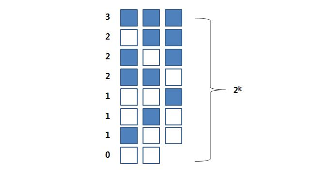

## Regression

- $y=\theta_{0} + \theta_{1x1}+ \cdots + \theta_{pxp} + \varepsilon = \theta^{T}x + \varepsilon$  <br/> <br/>
- $\theta = (\theta_{0}, \cdots, \theta_{p})$ is a $1 \times (p+1)$ matrix <br/> <br/>
- **variables** : $(p+1) \times 1$ matrix <br/>
    + $x = [1, x_{1}, \cdots, x_{p} ]$ <br/> <br/>
- $h_{\theta}(X_{1'},\cdots,X_{p}) = \theta^{T}x$ <br/> <br/>
- $\hat{y}=h_{\theta}(X_{1'},\cdots,X_{p}) = \theta_{0} + \theta_{1}x_{1}+ \cdots <br/> <br/> +\theta_{p}x_{p}$
<br/>
<br/>

#### Cost function = mean squared error (평균 오차 제곱)
- 최소 자승법, Least Square: 제곱을 최소화 시키는 방법 <br/> <br/>
- $J(\theta) = \frac{1}{2m}\sum_{i=1}^{m}(\hat{y}_{i} - y_{i})^{2}$<br/>
  $= \frac{1}{2m}\sum_{i=1}^{m}(h_{\theta}(x_{i1},\cdots,x_{ip})-y_{i})^{2}$ <br/> <br/>
- Find $\theta$ which minimizes $J(\theta)$ <br/> <br/>
- Example : p=1 (simple linear regression)
$$J(\theta_{0}, \theta_{1}) = \frac{1}{2m}\sum_{i=1}^{m}(\hat{y}_{i} - y_{i})^{2}
          = \frac{1}{2m}\sum_{i=1}^{m}(h_{\theta}(x_{i})-y_{i})^{2}$$

<br/>


## Finding coefficients
- Least square method
    + Find $\theta$ that minimizes $J(\theta)$
    + $J(\theta)$ is a convex function (quadratic)
    + Use normal equation: Find $\theta$ such that $(\frac{dJ(\theta)}{d\theta}=0)$
    + Use the gradient descent method


 <br/>
 
## Gradient Descent Method
- Gradient descent algorithm is to repeat until convergence
$$\theta_{j} := \theta_{j} - \alpha \frac{\partial}{\partial\theta_{j}}J(\theta_{0}, \theta_{1})$$


## Gradient Descent Method (p=1)
- Minimize
$$J(\theta_{0}, \theta_{1}) = \frac{1}{2m}\sum_{i=1}^{m}(\hat{y}_{i} - y_{i})^{2}
          = \frac{1}{2m}\sum_{i=1}^{m}(h_{\theta}(x_{i})-y_{i})^{2}$$
          
- Repeat until convergence: 
    + $\theta_{0} := \theta_{0} - \alpha\frac{1}{m}\sum^{m}_{i=1}(h_{\theta}(x_{i})-y_{i})$
    + $\theta_{1} := \theta_{1} - \alpha\frac{1}{m}\sum^{m}_{i=1}((h_{\theta}(x_{i})-y_{i})-x_{i})$

    + $\frac{\partial}{\partial\theta_{j}}J(\theta_{0}) 
= \frac{\partial}{\partial\theta_{j}} \frac{1}{2}(h_{\theta}(x)-y)^{2}$ <br/>
$= 2·\frac{1}{2}(h_{\theta}(x)-y)·\frac{\partial}{\partial\theta_{j}}(h_{\theta}(x)-y)$ <br/>
$= (h_{\theta}(x)-y)·\frac{\partial}{\partial\theta_{j}}\begin{pmatrix}
\sum^{n}_{i=0}\theta_{i}x_{i}-y
\end{pmatrix}$ <br/>
$= (h_{\theta}(x)-y)x_{j}$ <br/>

<br/>
<br/>
  
## Normal equqation
- **Find** $\theta$ such that $(\frac{dJ(\theta)}{d\theta}=0)$ <br/> <br/>
- $\hat{\theta} = (X^{T}X)^{-1} X^{T}y$ <br/> <br/>

| Gradient Descent | Normal Equation |
|:------------:|:------------:|
| Need to choose alpha | No need to choose alpha |
| Needs many iterations | No need to iterate |
| $O(p^{2})$ <br/> Works well when n is large | $O(p^{3})$ <br/> SLow if n is very large |

 <br/>
 
## Simple Linear Regressin using Excel
(2013년형, 현대 소나타 데이터)

#### Data Screening
- **Y = X(주행거리)**
- 기타 X: 연식, 차종 ,사고, 청결, 소유형태 등 여러가지 영향을 주는 요인이 있을 수 있음 


#### noise 를 줄이는 방법

1. Control (통제)
    + 연식 = 2013년형
    + 차종 = 소나타
    + 단점 : 데이터의 양이 적어짐 
    
2. Multiple regression : 차원을 높여서(x변수 갯수를 높여서) 
    + X2 = 연식
    + x3 = 차종
    + x4 = 사고
    + 단점 : 복잡도가 높아질 수 있음 

<br/><br/>

## 차트, 추세선 그리기
- 분석도구 추가 : 파일 -> 옵션 -> 추가기능 -> 분석도구 -> 확인

1) 삽입 -> 차트(분산형)
2) 차트내 점에서 우클릭 -> 추세선 추가(R); 선
    + 수식을 차트에 표시(E) 항목 선택 
    + R-제곱 값을 차트에 표시(R) 항목 선택 
    

<br/><br/>

## 회귀 분석 

1) 데이터 --> 데이터분석 --> 회귀 분석


<br/>

2) 입력
    + Y축 입력 범위 : 가격
    + X축 입력 범위 : 주행거리
    + 이름표 항목 체크 (첫행은 변수명)


<br/><br/>

## 회귀 분석의 해석


<br />

1. **기울기 해석 : 0.06232 **
    + This is the slope of the line. or each additional mile on the odometer, the price decreases by an average of 0.0623 USD 
    + 수학적 해석 <br/>
    ① 기울기가 - 이면 반비례 (x는 증가하면, y는 감소), <br/>
    ② 0.06232 : x가 1unit↑, y는 0.06232↓ 
    + Industry에 맞는 해석을 하는 것이 더 좋은 해석 <br/> 
      => 주행거리가 1만 마일 증가하면, 623달러 하락한다.
 <br/> <br/>

2. **절편 해석 : 17066.77**
    + The intercept is $b_{0} = 17067$ USD
    + 수학적 해석 : 신차의 가격은 17066.77 이다? (x)
    + 회귀식의 높낮이 결정을 위해 절편은 필요하지만, 이 경우 기울기만 해석하면 됨
    + 절편이 의미있는 해석이 되려면, 절편이 데이터 존재 범위내에 있어야 함
    <br/> --> 즉, 절편이 데이터 존재 범위 내에 있지 않다면 해석할 필요 없음
 <br/> <br/>
 
3. **P value : Y절편 based ** 
    - 2번에 따라 해석하지 않음
 <br/> <br/>
 
4. **P value : 기울기 based : 4.44E-24**
    - P value가 0.05보다 작으면 유의하다 (모집단에 대해서도 적용 가능)  
    - 주행거리가 중고차 가격에 영향을 미친다는 가설은 아주 유의하다
    <br/> --> 즉, 주행거리가 중고차 가격에 엄청나게 영향을 준다.
 <br/> <br/>
 
 
5. **하위 95%, 상위 95% (신뢰구간)**
    - 0.0623은 표본의 기울기 이고,
    - 모집단의 참 기울기는 -0.07148과 -0.05315 사이에 존재할 것
 <br/> <br/>
 
6. **결정계수 : 0.650132**
    - 65% of the variation in the auction selling price is explained by the variation in odometer reading. The rest (35%) remains unexplained by this model.
    - Coefficient of determination = $R^{2}$ = 설명력 (0 ~ 100%)
    - 주행거리가 중고차 가격의 65%를 설명했다. 35%에 대해 설명을 못한 부분이 남아있다는 것을 의미 
    - (아마도 다른 변인; 사고건수 10%, 차량의 청결상태5% , 색상 ...% 등)
 <br/> <br/>
 
7. **유의한 F**
    - 0.05 보다 작으면 유의하고, 크면 유의성이 없다고 해석한다.
 <br/> <br/>
 
## $R^{2}$ 의 기준은 데이터/분야 마다 다를 수 있음

1. 데이터가 simple 하고 복잡하지 않을 경우
    + 의학, 약학 : 실험 데이터는 > 0.8
2. 데이터가 복잡하고, x 변수가 많은 경우 
    + 금융, 경제 : 관찰 데이터는 > 0.1
 <br/> <br/>
 
- **$R^{2}=0.85$, p-value = 0.00001 가능 (ideal)**
    + 모델링을 잘 한 것 
    + ideal한 회귀분석 : $R^{2}$는 높고, p-value는 낮은 것
- $R^{2}=0.04$, p-value = 0.00001 가능
    + 모델링이 나쁜 것은 아니나, 설명력이 있는 x변수가 더 있어야 함
    + 단, 데이터에 포함되지 않은 유의한 x 변수가 많이 남아 있음 
- $R^{2}=0.04$, p-value = 0.35 가능
    + 모델링이 잘못된 것.
    + 중요한 변수가 아닌 것으로 회귀분석을 했음.
    + 즉, 설명력이 없는 x변수를 모델에 선택했기 때문일 수 있음 
    + 데이터 수집을 잘못했거나 설명력 있는 유의한 변수를 선정하지 못함.
- $R^{2}=0.85$, p-value = 0.35 불가능
 <br/> <br/>

## Nominal(=categorical) Independent Variables
- Regression 을 위한 x변수 중에 1개 이상의 변수가 범주형 데이터인 경우
- dummy variable (지시변수, 더미변수) 형태로 **0 , 1**로 만들어 냄
    + I = 1 if a degree earned is in Finance
    + I = 0 if a degree earned is not in Finance
    
- 범주 갯수가 m 개라면, 지시변수(dummy variables)는 m-1개만 만들어도 모든 변수를 할 수 있음. 
    + 정보의 중복이 일어나 x 변수중 상관관계가 100%인 것이 있어서 오류가 될 수 있음 

#### Three color categories are considered :
- White
- Silver
- Other colors
- Note: Color is a nominal variable.


- $I_{1}$ 
    + = 1 if the color is white, 
    + = 0 if the color is not white
- $I_{2}$
    + = 1 if the color is silver, 
    + = 0 if the color is not silver
- The category "Other colors" is definde by: $I_{1} = 0; I_{2} = 0$

#### Solution
- the proposed model is <br/>
$y = \beta_{0} + \beta_{1}(Odometer) + \beta_{2}I_{1} + \beta_{3}I_{2} + \epsilon$

- The revised data : 


<br/><br/>


<br/><br/>
<br/>
<br/><br/>

#### from Excel, we get the regression equation
- $PRICE = 16701 - .0555(Odometer) + 90.48(I_{1}) + 295.48(I_{2})$ 

- Silver color car : $PRICE = 16701 - .0555(Odometer) + 90.48(0) + 295.48(1)$
    + 은색 차량은 기타 색상 차량보다 평균적으로 295.48 USD 정도 가격이 비싸게 팔리고 있음 
    + 은색 차량은 흰색 차량보다 평균적으로 약 205 USD 정도 가격이 비싸게 팔리고 있음 
- white color car : $PRICE = 16701 - .0555(Odometer) + 90.48(1) + 295.48(0)$
    + 흰색 차량은 기타 색상 차량보다 평균적으로 90.48 USD 정도 가격이 비싸게 팔리고 있음 (절편의 차이)
- other color car : $PRICE = 16701 - .0555(Odometer) + 90.48(0) + 295.48(0)$
- 주행거리가 미치는 영향도는 동일(기울기)하고, 색상이 미치는 가격차가 얼마인지 찾는 방법
<br/><br/>

#### from Excel, p-value
- I-1은 유의하지 않은 변수 (p-value > 0.05)
- for Final model : 모든 x변수가 다 유의해질 때까지 변수를 선정해 주어야 
<br/><br/>

#### 아래와 같이, 회귀분석을 각각 하게 되면 
- 기울기가 변경되고, 데이터 모수가 작아져 p-value에 영향을 줌  (지양할 것)
    + White car Y = X1
    + Silver car Y = X2
    + Other Y = X3
- 통계학적으로는, 하나의 모델에 많은 변수를 담는 것이 좋음 

## Variable Selecction (=Feature Selection)
#### 1. All Subsets
- 모든 경우의 수를 따지기 때문에, 이론적으로는 BEST이지만 
- 계산량이 지수로 늘어나기 때문에, 현실적으로는 잘 쓰지 않음 (X변수가 20개면, 100만번 회귀분석을 해야 함)

<br/><br/>

#### 2. Backward Elimination (후진 제거법)
- 뒤로가면서 설명력이 낮은 X변수를 하나씩 빼줌 ==> 모든 x변수가 유의해질 때까지, 해당 단계에서 p-value 가 가장 큰 x를 하나씩 제거해줌
    + 계산량은 x변수의 갯수 만큼 
    + 엑셀을 사용할때는 이방법이 가장 좋음 (가장 빠르기 때문)
    + p-value에 tie가 있더라도, 하나씩 빼줌 (x변수간 correlation이 높은 경우, 다음 단계에서 남은 변수가 유의해질 수 있음)
1) Fit the model containing all (remaining) predictors
2) Test each predictor variable, one at a time, for a significant relationship with y
3) Identify the variable with the largest p-value. If P > α, remove this variable from the model, and return to (1.)
4) Otherwise, stop and use the existing model.

<br/><br/>

#### 3. Forward Selection (전진 선택)
- 후진제거법의 반대, x변수가 없다는 단계부터, 하나씩 추가해줌
1) Fit all models with one (more) predictor
2) Test each of these predictor variables, for a significant relationship with y
3) Identify the variable with the smallest p-value. If p < α, add this variable to the model, and return to (1.)
4) Otherwise, stop and use the existing model.

<br/><br/>

#### 4. Stepwise Selection
- 단계의 제거, 가장 많이 사용하는 방법으로 Backward와 Forward의 조합
    + 시작은 Backward로 시작함
    + 기존에 제거된 것 중 p-value 가 유의해지면 포함을 시킴 
- The Stepwise Selection method is basically Forward Selection with Backward Elimination added in at every step.

<br/><br/>

#### Final Model 
- Excel에서 I-1을 Backward elimination 으로 제거한 후 다시 Regression 수행 


<br/><br/>

<br/>


# R Example

```{r}
### Regression ###
### Used Car Data ###
# csv : comma seperated value
usedcar<-read.table('./DMdata/usedcar.csv',header=T, sep=',')

# Indicate values
Ind1<-as.numeric(usedcar$Color == 'white')
Ind2<-as.numeric(usedcar$Color == 'silver')

# lm : linear model (Y ~ X1 + X2 + X3, data = data.frame)
lm_used<-lm(Price ~ Odometer + Ind1 + Ind2, data=usedcar)
summary(lm_used)

# Variable Selection : Stepwise (direction=both)
# AIC : Akaike Information Crieterian 이 모델이 가지고 있는 정보의 효율성 (정보통계)
# AIC 값이 작을수록 좋음 
step_used<-step(lm_used, direction='both')

# Y가 가격이라면, Odometer(주행거리), Ind2(차량색상 Silver)를 X변수로 예측한 모형이 가장 좋은 모델임 = Final Model
summary(step_used)

## Black dots = silver cars, Red dots = white + other cars
## 점선과 실선의 간격 차이가 Silver 냐 아니냐에 대한 가격차이가 됨 (=248 USD)
# Plot 은 점을 그려주는 function 
plot(Price~Odometer,data=usedcar,col=ifelse(usedcar$Color=='silver','black','red')) # if(color==silver) black, else red
# Lines 는 선을 그려주는 function 
lines(x <- c(19000,49300), y=16740-0.05533*x) # 실선 
text(40000, 15300, "y=16988.9-0.05533*x") # x좌표, y좌표에 "이 텍스트"를 표기 
lines(x <- c(19000,49300), y=16988.9-0.05533*x, lty=3) # 점선 
text(31000, 14500, "y=16740-0.05533*x")
```

## Interaction with categorical variable (상호작용)
- $y= X_{1} + I_{1} + I_{2} + I_{1}·X_{1} + I_{2}·X_{2}$<br/>
  $y= \theta_{0} + \theta_{1}·X_{1} + \theta_{2}·I_{1}+ \theta_{3}·I_{2}+ \theta_{4}·I_{1}·X_{1}+ \theta_{5}·I_{2}·X_{1}$ <br/>
  $y=16960 - 0.0624·X_{1} - 692·I_{1} + 258·I_{2} + 0.0207·I_{1}·X_{1}$<br/>

- white : $I_{1} = 1, I_{1} = 0$ 
    + $y= \theta_{0} + \theta_{1}·X_{1} + \theta_{2} + \theta_{4}·X_{1} = (\theta_{0} +\theta_{2}) + (\theta_{1} + \theta_{4})·X_{1}$
    + $y=(16960-692) - (0.0624-0.0207)·X_{1}$
    
  
- silver : $I_{1} = 0, I_{1} = 1$ 
    + $y= \theta_{0} + \theta_{1}·X_{1} + \theta_{3} + \theta_{5}·X_{1} = (\theta_{0} +\theta_{3}) + (\theta_{1} + \theta_{5})·X_{1}$
    + $y=(16960 + 258) - 0.0624·X_{1}$
  
- others : $I_{1} = 0, I_{1} = 0$ 
    + $y= \theta_{0} + \theta_{1}·X_{1}$
    + $y=16960 - 0.0624·X_{1}$


```{r}
# 기울기가 색상별로 다를 수 있는지 확인하는 모델 
# 주행거리와 색상과의 상호작용이 있을 수 있다는 것을 허용하는 모델 
int_used<-lm(Price ~ Odometer+Ind1+Ind2+Ind1:Odometer+Ind2:Odometer, data=usedcar)
# 고차원의 계층이 유의하면 저차원의 계층은 살려놓음 (예: Ind1, Odermeter:Ind1)
summary(int_used) ## interaction effect

step_used<-step(int_used,direction='both')
summary(step_used) ## interaction effect
plot(Price~Odometer,data=usedcar,col=
ifelse(usedcar$Color=='silver','black',ifelse(usedcar$Color=='white','red','green')))
lines(x <- c(19000,49300), y=17218-0.06235*x)    
text(38000, 15300, "y=17218-0.06235*x")
lines(x <- c(19000,49300), y=16267.9-0.04165*x, lty=3)    
text(25000, 14900, "y=16267.9-0.04165*x")
lines(x <- c(19000,49300), y=16960-0.06235*x, lty=4)    
text(42000, 14000, "y=16960-0.06235*x")
```

## Assumptions of Regeression


<br/>

## Regression Diagnostics (회귀 진단)
- Three conditions required for a regression (가정이 맞아야 p-value를 신뢰할 수 있음)
    + **The error variable must be normally distributed (정규성)**
    <br/> :라인을 중심으로 좌우가 어느 정도 대칭인 모형인가
    + **The error variable must have a constant variance (등분산성)**
    <br/> : 라인을 중심으로 값들의 분포가 고른가, 즉 정규분포의 형태와 유사한가
    + The errors must be independent of each other (독립성)
    <br/> : 데이터가 각각 독립적이어야 함
    
- Residual $= Y - \hat{Y}$
    + differences between the actual data points and those predicted by regression
    
- Residual Analysis : examine the residual


### Normality (정규성 체크)
- **Q-Q plot** to visually check for normality
    + 오차들의 qq plot 이 45도 라인에 잘 맞는지
    + 정규분포라면 45도 라인에 근접함
```{r}
plot(step_used, which=2) ## QQ plot
```
<br/><br/>

### Heteroscedasticity (등분산성 체크)
- We can diagnose heteroscedasticity by plotting the residual against the predicted y

<br/><br/>
- 잔차의 퍼짐
- 정규분포의 모양이 바뀌고 있음 (점점 퍼져나가고 있는) 형태라면 바람직 하지 않음 
    + y변수에 log를 취하는 등의 변화가 필요함

```{r}

plot(step_used, which=1) ## fitted values vs. residuals
```


