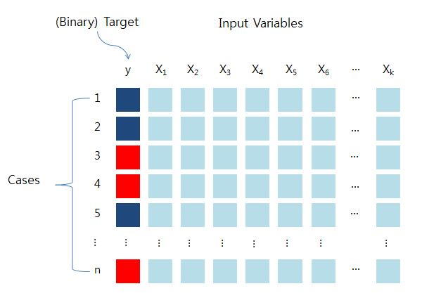
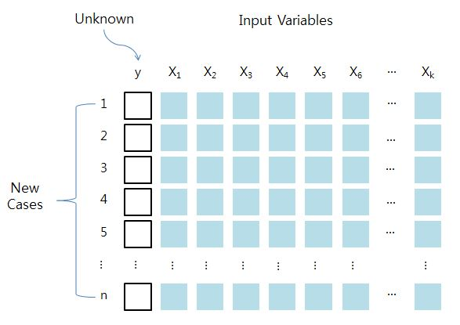
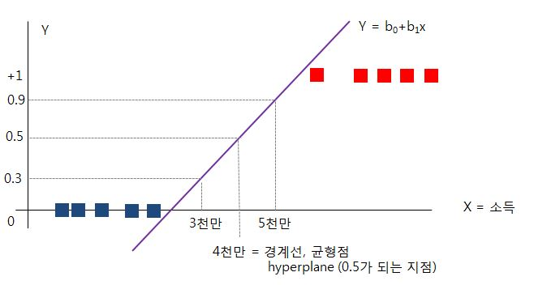
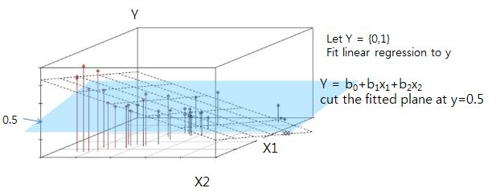
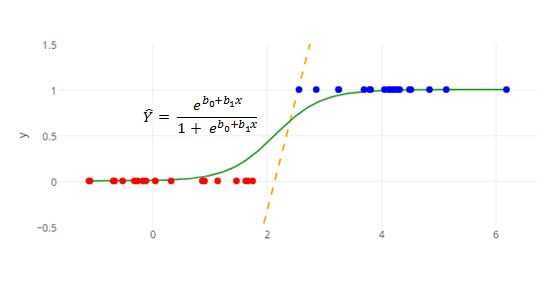
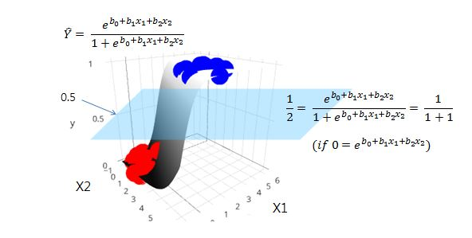
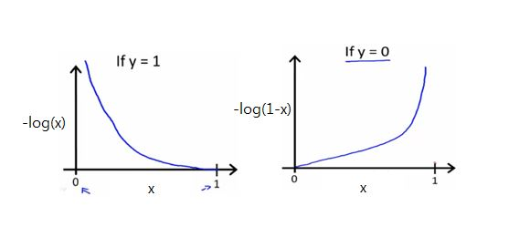
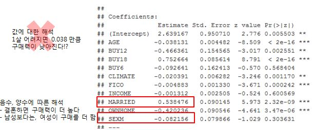

## Classification
- Predictive modeling for categorical or discrete values (or class)
    + Y변수가 범주형 일때 
    + X변수는 연속형일 수도 있고, 범주형일 수도 있도 모두 가능
- Identify the group to which each case belongs, for example,
    + likely to respond to a direct mail solicitation
    + vulnerable to switching to a competing long-distance phone service
    + Good or bad credit risk
- Classification model is created by examining training data
- Success can be measured on a fresh data
- Classification models
    + Decision Trees
    + Neural Networks
    + Support Vector Machine
    + Discriminant Analysis
    + Logistic Regression
    + K-nearest neighbor
    
<br/><br/>

#### Supervised Classification


<br/><br/>

#### Generalization


<br/><br/>


#### Linear regression for Classification
- idea 차원으로 참고만 할 것 : 회귀분석에서 Y변수를 범주형으로 바꾸지는 않음
- 션형 회귀분석을 이용한 분류모델은 작동은 하나 0과 1을 벗어나므로 제대로 된 모델은 아님

<br/><br/>

#### Fitted plane of Linear regression


<br/><br/>

- Hyperplane
    + 의사결정 판단 기준이 되는 지점
    + ${(x_{1},x_{2}) : b_{0} + b_{1}x_{1}+b_{2}x_{2}} = 0.5$

## Logistic Regression
- sigmoid 함수 $\hat{Y}=\frac{e^{b_{0}b_{1}x}}{1+e^{b_{0}b_{1}x}}$

<br/><br/>

- Sign of $b_{1}$ : indicates whether the curve ascend or descend
- $|b_{1}|$ : indicates the rate of change (increase as $|b_{1}|$ increases)
    + 값이 클수록 경사도가 높음 
- If $b_{1}=0$, then flat line
    + 폭포의 경사도가 없음. 폭포가 평평해서 확률을 예측할 수 없음 
- Unlike the linear regression, the logistic regression permits the rate of change to cary as x varies
<br/><br/>

#### Fitted plane of Logistic regression


<br/><br/>

#### Logistic Discrimination

#### Hypothesis Representation
- Coefficients are found via MLE procedure
- Cut the fitted plane at y=0.5
- ${(x_{1},x_{2}) : b_{0} + b_{1}x_{1}+b_{2}x_{2}} = 0$
<br/><br/>
- $\hat{y}=P(y=1|x;\theta) = h_{\theta}(x)$
- $h_{\theta}(x) = g(\theta^{T}x)$
- $x=\theta^{T}x$
- $g(z) = \frac{1}{1+e^{-z}}=\frac{e^{z}}{1+e^{z}}$

## Cost function



- **Simplified cost function**

$$J(\theta)=-\frac{1}{m}\sum^{m}_{i=1}[y^{(i)}log(h_{\theta}(x^{(i)}))+(1-y^{(i)})log(1-h_{\theta}(x^{(i)}))]$$

- Gradient descent method
$$Repeat \begin{Bmatrix}
\theta_{j} := \theta_{j} - \alpha \frac{\partial}{\partial\theta_{j}}J(\theta)
\end{Bmatrix}$$

<br/><br/>
==> 
$$Repeat \begin{Bmatrix}
\theta_{j} := \theta_{j} - \frac{\alpha}{m}\sum^{m}_{i=1}(h_{\theta}(x^{(i)}))-y^{(i)})x^{(i)_{j}}
\end{Bmatrix}$$

## BUYTEST Example 
- Marketing Data 
- 잠재고객들에게 DM발송 후, 응답가능성이 높은 모델 발굴

|범주 | 변수 | 변수의 내용|
|-----|-----|-----|
|인구속성|Age|나이(년)|
||Income|년수입(1000$)|
||Married|1:결혼, 0:미혼|
||Sex|F:여자, M남자|
||Ownhouse|1:소유, 0:미소유|
|지역속성|Loc|거주지(A-H)|
||Climate|거주지의 기온(10,20,30)|
|거래회수|Buy6|최근 6개월 간의 구입회수|
||Buy12|최근 12개월 간의 구입회수|
||Buy18|최근 18개월 간의 구입회수|
||Buy24|최근 24개월 간의 구입회수|
|신용상태|Fico|신용점수|
|거래속성|Orgsrc|고객분류(C,D,I,O,P,R,U)|
||Discbuy|할인고객 여부(1:할인고객, 0)|
||Return24|지난 24개월간 상품의 반품여부 (1:반품, 0)|
|응답|Respond|광고메일에 응답여부(1:응답, 0)|
||Purchtot|광고메일에 의한 구입총액|
||C1-C7|광고메일에 의한 품목별 구입액|
|고객번호|ID|고객번호|

```{r}
### Logistic Regression ###
### Buytest Data ###
buytest = read.table('./DMdata/buytest.txt',sep='\t',header=T)
head(buytest,10)

# SEX = F or M (범주형 변수)
# family = binomial() 을 표기해야 Logistic Regression을 수행함, default 값은 family - normal() 로 Regression을 함 
full_m = glm(RESPOND~AGE+BUY12+BUY18+BUY6+CLIMATE+FICO+INCOME+MARRIED+OWNHOME+SEX,
             family=binomial(),data=buytest)

# 변수에 * 갯수가 많을수록, p-value가 작고, 유의하다는 의미 
summary(full_m)
```


<br/><br/>

```{r}
back_m = step(full_m) #direction='backward' is default
summary(back_m)

## 설명력을 나타내는 R-square가 없기 때문에, training 데이터로 예측을 수행해
prob_pred = predict(back_m, newdata=buytest, type='response', na.action=na.omit) ## predicted probability
head(prob_pred,20)
y_actual = na.omit(buytest)$RESPOND
table(y_actual) # actual 
table(y_actual)/sum(table(y_actual))
y_pred = as.numeric(prob_pred > 0.05) # cut-off value = 0.05 (구매확률이 0.05만 넘으면 구매하는 것으로 결정-> 기준을 매우 완화)
tab=table(y_actual, y_pred)
print(tab)
tab[,2]
# 기존 10,000명 DM -> 0.07494603
# DM 발송 후 구매 할 확률 (6262+637) -> 0.09233222
# 약 7천명에게 발송했으므로, 비용은 적게썼고 구매 확률(0.749-->0.092)은 더 높아졌다.
# 매출이 줄었는지는 알수 없지만, 비용을 절감했으므로 순익은 증가할 수 있다. 
tab[,2]/sum(tab[,2])
```

- x값이 하나 늘어나면, y의 odds가 (y의 가능성이) #'배' 늘어남
- AGE가 1 늘어나면 구매가능성이 0.9625배 감소함, 즉 구매가능성이 줄어듬 
- MARRIED (0->1, 미혼에서 기혼으로) 변경되면 1.712배 정도 구매가능성이 늘어남 
    + 즉 결혼하면 구매를 더 많이 함
- Logistic Regression에서는 Odds ratio를 잘 해석하는 것이 중요 
- 계수가 음수면, Odds ration가 1보다 작아짐 -> 이럴경우 가능성이 #배 줄어든다고 해석 


```{r}
## odds ratio
exp(coef(back_m)) 
```


## The Logistic Function

- ① $\hat{y} = \frac{e^{b_{0}+b_{1}x}}{1+e^{b_{0}+b_{1}x}}$ <br/>
- $\hat{y}(1+e^{b_{0}+b_{1}x}) = e^{b_{0}+b_{1}x}$ <br/>
- $\hat{y} = e^{b_{0}+b_{1}x}- \hat{y}e^{b_{0}+b_{1}x}$<br/>
- $\frac{\hat{y}}{1-\hat{y}}=e^{b_{0}+b_{1}x}$ : this is called a Odds<br/>
- ② $log(\frac{\hat{y}}{1-\hat{y}}) = logit(\hat{y}) = b_{0} + b_{1}x$
<br/><br/>

#### The Logit Link Function

#### Scoring New Cases

## Odds
- Odds = probability that some event will occur / probability that some event will not occur
- The ratio $\frac{p}{1-p} = \frac{P(y=1)}{P(y=0)}$ is called the odds, and is a function of the probability p
    + 도박사들의 우승 배당률 (odds는 확률이 아니라, 확률의 비율임)
    + 도박사 4명중, 브라질이 우승할 거라고 예측한 사람 1명, 아닌 사람 3명 -> 1:3 = 1/3
    + 도박사 31명중, 대한민국이 우승할 거라고 예측한 사람 1명 -> 1:30 = 1/30 (대한민국 우승의 odds)
- Consider the model with one predictor (k=1) : 
    + Logit : $ln\begin{pmatrix}\frac{p}{1-p}= \alpha + \beta X \end{pmatrix}$
    + Odds : $\frac{p}{1-p}=e^{\alpha+\beta X}=e^{\alpha}(e^{\beta})^{X}$
<br/><br/>

#### Odds Ratio
- Ratio of two odds
- Odds ratio를 이용해서 계수, $\theta$ 값들의 해석 가능
- E.g.1) A=store owners, B=salesmen
    + $P(default_{A})=0.25$, $P(default_{B})=0.10$
    + $Odds(default_{A})=1/3$, $Odds(default_{B})=1/9$
    + OR(A:B)=3
    + Store owners have three times higher risk of becoming default than salesman
- E.g.2)
    + Odds ration = 1/3 / 1/30 = 10
    + 브라질은 대한민국보다 우승 배당율 비율이 10배 더 높음 

## Logistic Regression & Odds Ratio

- Recall : $\frac{\hat{y}}{1-\hat{y}}=e^{b_{0}+b_{1}x}$ = odds when x is given
- Odds when (married = 1) -> $e^{b_{0}+b_{1}1}$
- Odds when (married = 0) -> $e^{b_{0}+b_{1}0}$
- Odds ratio of (married = 1 vs. 0) -> $e^{b_{1}}$
- $e^{0.5421}=1.7197$
- Every 1 unit increase in X increases th odds by a factor of $e^{b_{1}}$
- E.g.
    + Age=25 -> $e^{\theta{0}+\theta_{1}25}$
    + Age=26 -> $e^{\theta_{0}+\theta_{1}26}$
    + Odds Ratio -> $\frac{e^{\theta_{0}+\theta_{1}26}}{e^{\theta_{0}+\theta_{1}25}} = \frac{e^{\theta_{0}}·e^{\theta_{1}26}}{e^{\theta_{0}}·e^{\theta_{1}25}}= e^{\theta_{1}26-\theta_{1}25} = e^{\theta_{1}}$ = Odds Ratio
    + 25세와 26세의 구매비율 차이는 $e^{\theta_{1}}$ 만큼이다.
    + 즉, 구매가능성이 $e^{\theta_{1}}$배 만큼 높아진다.
<br/><br/>
- Thus, $e^{\beta}$ is the odds ratio, comparing the odds at x+1 with the odds at x
- An odds ratio equal to 1 (i.e., $e^{\beta}=1$) occurs when $\beta = 0$, which describes the situation where the predictor x has no association with the response y


## Multi-class values
- 일반적으로는 이항 로지스틱 회귀분석(binary Logistic Regression)
- Y변수의 범주의 갯수가 2개 이상인 경우,

