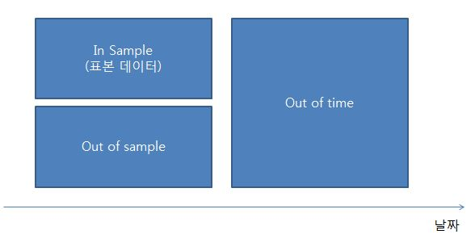
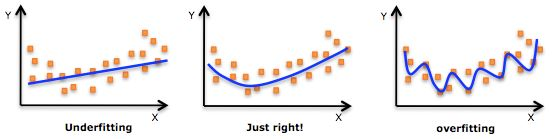

## Data Roles
- In sample : 개발에 사용된 데이터
- Out of sample : 개발에 사용되지 않은 동시점의 데이터
- Out of time : 개발 후 관찰된 데이터



- In sample 데이터를 둘로 쪼개 Training 과 Test 데이터로 분리

#### Training Dataset
- The training set shold : 
    + be **representative** of the entire data set
    + cover the full range of values for all the predictors that the model might encounter
    + contain a sufficient number of observations of rare events (i.e. balancing the outputs)

- A random sample of available data are not sufficient since the **rare observations** may not be chosen. Solution: startified sampling (층화 추출)
    + rare observation 케이스인 경우, 한쪽으로 쏠림 현상이 발생할 수 있으므로, training 과 test 데이터를 나눌 때 주의
    + 즉, 우량 고객 내에서 Training/Test 로 쪼개고, 불량 고객 내에서 Trainin/Test 데이터를 쪼갬 

#### Test Dataset

#### R example

```{r}
### Model Evaluation ###
#####Fitting by training data and validating by test data
buytest = read.table('./DMdata/buytest.txt',sep='\t',header=T)
head(buytest)
set.seed(1234) # train/test 구분을 동일하게 할 수 있음, 같은 초기값을 줌 
i = sample(1:nrow(buytest), round(nrow(buytest)*0.7)) #70% for training data, 30% for testdata
train = buytest[i,] 
test = buytest[-i,]

paste0('Train: ',nrow(train), ', Test: ', nrow(test))
```


## Model Complexity 


<br/><br/>

## Overfitting

## Model comparison in Classification
- Accuracy
- **Lift chart**
- Profit chart
- **ROC curve**
- K-S statistics


## 1. Accuracy

#### Confusion Matrix
|||Predicted Class||
|--|--|:--:|:--:|:--:|
|||0|1|
|Actual Class|0|**True Negative**|False Positive|
||1|False Negative|**True Positive**|
- Accuracy : 대각의 합/전체 

| | |Predicted Class| | |
|--|--|:--:|:--:|:--:|:--:|
| | |Non-Buyer|Buyer| |
|Actual Class|Non-buyer|8500|500|9000|
| |Buyer|500|500|1000|
| | |9000|1000|10000|


<br/><br/>

#### Error Rates


```{r}
### 모형평가 ###
# na.omit -> missing value 가 있는 경우 제거

train=na.omit(train) 
test=na.omit(test)
paste0('Train: ',nrow(train), ', Test: ', nrow(test))

model1 = glm(RESPOND~AGE+BUY12+BUY18+FICO+MARRIED+OWNHOME,family=binomial(),data=train)
model2 = glm(RESPOND~AGE+FICO+MARRIED+OWNHOME,family=binomial(),data=train)
summary(model1)
summary(model2)
prob_pred1 = predict(model1, newdata=test, type='response') ## predicted probability
prob_pred2 = predict(model2, newdata=test, type='response') ## predicted probability
y_pred1 = as.numeric(prob_pred1 > 0.1)
tab1=table(test$RESPOND, y_pred1)
print(tab1)
sum(diag(tab1))/sum(tab1)
y_pred2 = as.numeric(prob_pred2 > 0.1)
tab2=table(test$RESPOND, y_pred2)
print(tab2)
sum(diag(tab2))/sum(tab2)
```

## 2. Lift (Gain) charts

- The scored data set is sorted by the posterior probabilities of the event level in descending order
- The observations are then grouped into deciles
- The x-axis is sample size or proportion
- The y-axis can be
    1) % Captured Response : 반응 검출율 
    2) % Response : 반응율 (1등급 부터 후순위가 급경사를 이루는 모델이 좋은 모델)
    3) Lift : 향상도 (반응율/실제구매자비율= xx) --> 반응율이 xx배 늘어남 

<br/><br/>

#### Generating a lift chart
| Decile | Frequency of "buy" | % Captured Response | % Response | Lift |
|:-----:|:-----:|:-----:|:-----:|:-----:| ##TBD
|1 | 174|174/381=45.6  |174/200|87/19=4.57|
|2 | 110|110/381=28.8  |174/200|87/19=4.57|
|3 | 38 |38/381=9.9    |174/200|87/19=4.57|
|4 | 14 |14/381=3.6    |174/200|87/19=4.57|
|5 | 11 |11/381=2.8    |174/200|87/19=4.57|
|6 | 10 |10/381=2.6    |174/200|87/19=4.57|
|7 | 7  | 7/381=1.8    |174/200|87/19=4.57|
|8 | 10 |10/381=2.6    |174/200|87/19=4.57|
|9 | 3  |3/381=0.7     |174/200|87/19=4.57|
|10| 4  |4/381=1.0     |174/200|87/19=4.57|

- Baseline Lift = 381/2000 = 19.05%
<br/><br/>

#### Cumulative table (누적)
- 튀는 케이스가 있는데, 누적 시키면 이경우를 잡아 일관되게 감소함을 확인할 수 있음     
 
```{r}
### Lift Chart ###
scored_dat = cbind(prob_pred1,test$RESPOND)
head(scored_dat)
head(scored_dat[order(-prob_pred1),],30) # 확률의 내림 차순으로 정렬 
```

- 좋은 모형이라면 구매확률이 높을 수록, 실제 구매자가 많아야 함
    + 상위 1,2등급내에 실제 구매자가 많아야 좋은 모형이라고 할 수 있음 
- 10개의 등급을 만들어 줌
    + 예: 구매확률이 높은 상위 10%를 1등급으로 만듬

```{r}
#install.packages("BCA",repos="http://healthstat.snu.ac.kr/CRAN/")
#install.packages("munsell",dependencies=TRUE,repos="http://healthstat.snu.ac.kr/CRAN/")
library(BCA)

#layout(matrix(c(1,2), 2, 1)) #차트를 한 화면에 2개 볼 수 있음
test$RESPOND=factor(test$RESPOND)
# targetLevel="1" 구매자 카운팅
# type="incremental" 누적아님 
# trueResp = 0.07 실제 구매자의 비율 
lift.chart(c("model1","model2"), data=test, targLevel="1",  
    trueResp=0.07, type="incremental", sub="Test") 
# type="cumulative" 누적
lift.chart(c("model1","model2"), data=test, targLevel="1",
    trueResp=0.07, type="cumulative", sub="Test")  
```

#### Accuracy Ratio, CAP(cumulative accuracy profile)
- AR(Accuracy Ratio) : Lift chart의 그래프를 숫자로 계량화한 값
    = 지니계수 
    = 면적B / 면적A = 0.3627
- 1에 가까울 수록 좋은 값
    + 0.6이상 : good
    + 0.5이상 : moderate
    + 0.3 : 우리나라 금감원(은행) 최소 기준 

## 3. Profit chart
- expected profits or return on investment is an important measure
- how well the campaign works with information on cost
- to help with the decision of how to maximize profits (순익을 최대화)
- 비용과 매출, 수익구조를 고려한 Lift chart
- 단점 : 일반화 시키기는 어려움


## 4. R-Courve (** Recommended)

- ROC curves are similar to lift charts
- 
    + y축: 민감도
    + x축 : 1-특이도 
- 민감도와 특이도의 Cutoff value를 이용해서 그린 차트

#### Sensitivity & Specificity
- Sensitivity (민감도) : 구매자를 구매자로 찾아내는 능력
- Specificity (특이도) : 비구매자를 비구매자로 찾아내는 능력

|||Predicted Class||
|--|--|:--:|:--:|:--:|
|||Yes|No|
|Actual Class|Yes|**Sensitivity** <br/>TP|1-sensitivity <br/>FN|
||No|1-specificity <br/>FP|**Specificity**<br/> TN|

#### AUROC
- Area under the ROC curve : AUROC = (Ar+1)/2
     + ROC 커브의 아래쪽 면적
- AUROC 의 max 값은 100%, min은 50%
     + 0.8 : good
     + 0.75 : moderate
     + 0.65 : 우리나라 최소기준 
- AR 과 AUROC는 1:1 함수 관계에 있음

```{r}
### ROC커브 생성 ###
#install.packages("pROC",repos="http://healthstat.snu.ac.kr/CRAN/")
library(pROC)
roccurve1 <- roc(test$RESPOND ~ prob_pred1)
plot(roccurve1)
auc(roccurve1) # AUROC
roccurve2 <- roc(test$RESPOND ~ prob_pred2)
plot(roccurve2)
auc(roccurve2) # AUROC
```


## 5. K-S statistics

```{r}
### K-S 검정 ###
ks.test(prob_pred1[test$RESPOND==1], prob_pred1[test$RESPOND==0])
ks.test(prob_pred2[test$RESPOND==1], prob_pred2[test$RESPOND==0])
```
