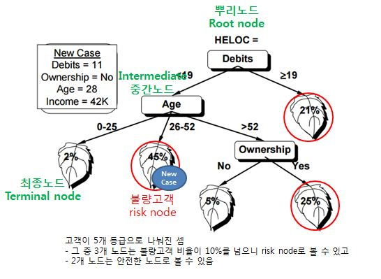
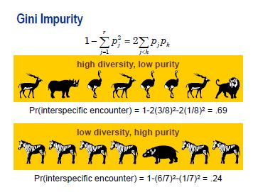
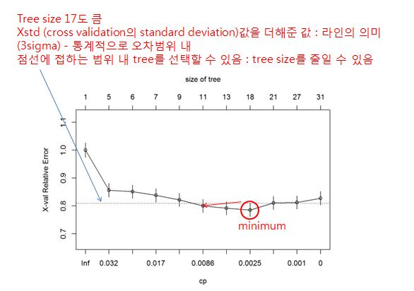

## Benefits of Trees
- Interpretability 
    + Tree structured presentation
    + 해석이 매우 쉬움
- Mixed Measurement Scales
    + Norminal, ordinal, interval
    + Regression trees
    + Classification trees
    + Y변수가 연속형/범주형 상관없이 모두 쓸 수 있음
- Robustness
- Missing Values
- DT는 변수선택에도 유용하고 활용 알고리즘이 다양함
    + NN변수선택 및 해석
    + Random Forest : Decision Tree-based ensemble (현존하는 훌륭한 기법 3개 중 하나)

- 단, DT 단일로는 정확도가 조금 떨어지는 단점이 있을 수 있음

## Fitted Decision Tree

- partition(=split, 분할)
- 기준에 의해 partition이 되면 y값의 분포가 달라짐
- "한쪽으로 치우침" 현상이 나타나도록 node를 분할해주어야함
    + 이렇게 치우쳐야 아래쪽에서 다시 "한쪽으로 치우치도록" 분할해줄 수 있음
    + 가급적 **빠르게 한쪽으로 치우치게(dominate)** 만들어 주는 것이 목표  



<br/>


## Example : Titanic Data

- 모든 X변수가 범주형이라 DT에 적합한 데이터 
- 만약 Logistic Regression을 사용하려면, dummy 변수가 너무 많이 만들어져야 하고 해석하기 쉽지 않을 수 있음 

```{r Titanic Example}
titanic<-read.table("./DMdata/titanic.csv",header=T,sep=',')
head(titanic, 10)
table(titanic$Survived, titanic$Class)

library(rpart)
DT <- rpart(Survived ~ ., data = titanic, method="class")
print(DT)

#install.packages("party")
library(party)
partyDT <- ctree(Survived~., data=titanic)
print(partyDT)
plot(partyDT)
```

#### Categorization
- Assume X1 variable having categories:
    + A,B,C,D, ... ,Y,Z
- A decision tree is constructed as follows :

(./img/08_categorization.JPG) 

<br/>
- Re-categrize X1 as{B,C,F,G},{H,P,S,W},{Other} and use it in other analysis such as logistic regression


## The Cultivation of Trees
- Split Search
    + Which splits are to be considered?
- Splitting Criterion
    + Which split is best?
- Stopping Rule
    + When should the splitting stop?
- Pruning Rule
    + Should some braches be lopped-off?
    
## Popular DT Algorithms
- 분할방법에 따라 Decision Tree의 종류가 달라짐
- **CART** (Classification & Regression Trees), also referred to as C&RT; 가장 유명
- **CHAID** (Chi-Square Automatic Interation Detecion)
- **C4.5** or C5
- Exhaustive CHAID
- QUEST (Quick, Unbiased, Efficient Statistical Tree)
- CRUISE

## CART approach
- **Divide-and conquer** (분할 후 계산) approach
    + 분할 후, Impurty & Goodness 계산 
- One variable at a time
    + 한번에 하나의 변수만 계산함 (1차원 계산)
- Binary decision rule
    + 무조건 모든 노드를 왼쪽/오른쪽 둘로만 분할함
- Numeric attribute: test whether value is greater or less than constant
- Nominal attribute: test whether value belongs to subset
- Greedy search using impurity measure 
    + 불순도를 이용한 탐욕 탐색법
    + greedy search : 탐색의 방법이 shortcut이 없고 계산할 수 있는 모든 방법을 계산함
    + Tree가 커지면 커질수록 계산량은 많음.
- Briman, Friedman, etc. 1984

## Gini Impurity (불순도)
- Impurity : 분포의 다양성

$$1-\sum^{r}_{j=1}p^{2}_{j} = 2\sum_{j<k}p_{j}p_{k}$$

- 사슴(3/8), 타조(3/8), 코뿔소(1/8), 사자(1/8) => 불순도 = 0.69
- 얼룩말 (6/7), 하마 (1/7) => 불순도 = 0.24
    + 종자가 다양하지 않은게 불순도가 작다 (순수해짐)
- 한쪽으로 치우치려면, 불순도가 작아져야 함 : DT의 목적 


<br/><br/>

## Impurity measure - CART
$$imp(t) = 1-\sum_{j}p^{2}(j|t)$$

(./img/08_impurity_measure.JPG) <br/>

- t1, t2의 Weighted average(가중 평균) = $(0.25*\frac{13}{25}) + (0.374*\frac{12}{25}) = 0.31$

## Goodness of Split - CART 
- Goodness(향상도) : 불순도가 좋아진 정도 
$$imp(t)-(n_{1}/n)*imp(t1)-(n_{2}/n)*imp(t2)$$ <br/>

 <br/>
- Goodness(s1) = 0.492 - 0.31 = 0.182
    + s1의 향상도= 0.182 
    + 이 DT는 0.182의 향상도(Goodness)가 있음

- Goodness(s2) = 0.492 - 0.189 = 0.303
    + s2의 향상도 = 0.303
    + 이 DT는 0.303의 향상도(Goodness)가 있음

- S2 is better split (S2로 split한 DT가 더 좋은 모델)

## The CART Algorithm
1. The basic idea is to choose a split at each node so that the data in each subset (child node) is "purer" than the data in the parent node. CART measures the impurity of the data in the nodes of a split with an impurity measure i(t)

2. If a split *s* at node *t* sends a proportion *$p_{L}$* of data to its left child note *$t_{L}$* and a corresponding proportion *$p_{R}$* of data to its right child node *$t_{R}$*, the decrease in impurity of split *s* at node *t* is defined as <br/>
향상도(Goodness) 계산 : $\Delta i(s,t) = i(t) - p_{L}i(t_{L}) - p_{R}i(t_{R})$ <br/>
= impurity in node *t* - weighted average of impurities in nodes *$t_{L}$* and *$t_{R}$* 

3. A CART tree is grouwn, starting from its root node (i.e., the entire training data set) t=1, by searching for a split s* among the set of all possible candidates S which give the largest decrease in impurity<br/>
MAX 향상도(Goodness) 선택 :
$\Delta i(s,1)=max$ $\Delta_{s∈S}$  $i(s,1)$ <br/>
Then node t=1 is split in two nodes t=2 and t=3 using split s*
4. The above split searching process is repeated for each cild node.
5. The tree growing process is stopped when all he stopping criteria are met.
     + iteration을 하면서, 아래 node에서도 향상도가 max 인것을 고름 

## Numerical variables - CART (연속형 변수)
 <br/>

## Categorical variables - CART (범주형 변수)
- 범주형 변수로는 어떻게 Greedy Search 를 할까?
    + 범주형 변수를 dummy 변수로 바꾸지 않음 
- 범주가 만들어낼 수 있는 부분집합의 경우의 수를 따짐
    + 정대칭인 경우는 안해봐도 됨 (예) KY vs TN, GA, FL / TN, GA, FL vs KY
    
## Impurity Measures
- Gini impurity와 Entropy impurity는 계산방법이 약간 다름
    + 기본적으로 원리(불순도를 계산하는 방법)는 똑같음
- Entropy (C4.5) : 
$imp(t) = - \sum^{J}_{j=1}p(j|t)log$  $p(j|t)$

- Gini index (CART) : 
$imp(t) = 1 - \sum^{J}_{j=1}p^{2}(j|t)$
<br/><br/>

## Tree Algorithm: Find Best Split fot Input

## Example : Pen-Digits Data 
- 손글씨 숫자(1,7,9) 자동인식


#### Depth 2
- Depth(깊이)가 2인 Tree


#### Depth 6
- 

#### Leaves of a Classification Tree
- Decision Tree도 확률을 예측할 수 있음
- 조건부 확률 (그 노드에 속한 7의 확률은?) : training 데이터의 확률
- 이 공간에 있을 때는 7이라고 예측함 
    + 단 7이될 확률은 얼마일까?
- Leaf 1에서
    + 1이될 확률은 3%, 7이될 확률은 96%, 9가될 확률 1%
    
## CART Stopping Criteria
- All cases in a node have identical values for all predictors
    + 모든 값이 똑같을때
- The depth of the tree has reached its pre-specified maximum value
    + 깊이가 미리 정해진 기준에 도달했을때
- The size of the node is less than a pre-specified minimum node size
    + size of the node(데이터갯수)를 몇개까지 허용시킬 것인지
    + 예: 분할 노드에 최소 10개 이상 될때만 분할한다.
- The node becomes pure, i.e., all cases have the same value of the target variable
    + 노드가 100% pure 해지면 분할하지 않는다.
- The maximum decrease in impurity is less than a pre-specified value
    + impurity(불순도)의 감소량이 기지정된 값에 도달할때
    + 일반적으로는 pre-specified value = 0 으로 지정함
    + 즉, 조금이라도 감소하면 분할하겠다는 의미 
    + (예) 최소기준 = 0.05이면, t=0.5 / t1=0.49, t2=0.48 일때 분할하지 않음 
- stopping rule 을 강화시키면 트리가 심플해지고, 완화시키면 트리가 거대해질 것
- DT에서는 Tree의 규모가 중요한 역할을 함.
    + Tree가 너무 크면 Over-fitting 할 수 있음 

## Example : HMEQ dataset
| 범주 | 변수이름 | 변수내용 |
|------|----------|----------|
| 목표변수(=Y) | BAD | 신용상태0(좋음), 1(나쁨) |
| 대출신청서 | REASON | 대출사유 (빚정리, 주택개량) |
| | JOB | 직업의 종류 (6개 범주) |
| | LOAN | 대출금액 |
| | MORTDUE | 저당금액 |
| | VALUE | 현재 자산 |
| | DEBTINC | 수입 대 부채비율(DTI) |
| | YOJ | 현 직장 근무년수
| 신용정보기관 | DEROG | 주요 부실거래 수
| | CLNO | 금융거래 수 |
| | DELINQ | 부실거래 수 |
| | CLAGE | 가장 오래된 거래의 개월 수 |
| | NIMQ | 최근 신용상태 조회수 |

- 이 데이터에는 Missing Value가 많은데, 특히 DEBTINC 에 Missing Value 가 많음
    + 이 데이터에는 Decision Tree가 좋음
- DT는 Missing Value에 영향을 많이 받지 않음 
    + One variable at a time, 즉 X변수를 하나씩 보기때문에 
    + Missing Value가 많은 X변수는 정보량이 얼마 없기 때문에 DT에서 선택이 안될 확률이 높음

#### R example 

```{r Decision Trees}

### Decision Trees ###
hmeq<-read.table("./DMdata/hmeq.txt",header=T,sep='\t')
head(hmeq,10)
levels(hmeq$REASON)[levels(hmeq$REASON)==""]<-NA
levels(hmeq$JOB)[levels(hmeq$JOB)==""]<-NA
head(hmeq,10)
hmeq$BAD<-factor(hmeq$BAD) #범주형 Y
class(hmeq$BAD)

# rpart(recursive partitioning) : CART 
library(rpart) 
set.seed(1234)
my.control <- rpart.control(xval=10, cp=0, minsplit=100)
# -------------------------
# xval(cross-validation) : Tree size결정에 사용, 일반적으로 xval=10으로 사용
# pruning 할때(weak branch찾을때) : validation data error
# 이때, 필요한 validation data를 training 90% / test 10% 사용함  
# random 하게 9:1로 쪼개기 때문에, set.seed 셋팅을 해주어야 매번, 누가하더라도 동일하게 데이터를 쪼갬 
# xval=10은 10번하라는 의미, 즉 10-fold cross validation 
# Tree를 11개를 만듬 (masimal tree 1개, 데이터 fold 에 따른 pruning tree 10개) 평균적인 weak branch 로 가장 낮은 것을 고름 
# -------------------------
# cp 향상도가 나아지는 값이 cp보다 작으면 분할 stop : 일반적으로 cp=0으로 사용
# minsplit : size of the node의 최소값 (한 노드의 데이터값) : 일반적으로 좀 작게 주는데 이 경우에는 좀 크게(100) 줌
D_tree <- rpart(BAD ~ ., data = hmeq, method="class", control=my.control)
print(D_tree)

# depth=14인 tree가 생성됨
# maximal Tree (overfitting의 뉘앙스)
plot(D_tree, uniform=T, compress=T, margin=0.05)  
```

## OVerffiting
- 트리가 너무 복잡

## Underfitting 
- 트리가 너무 간단

## Pruning (가지치기)
- After the splitting stops because of the stopping criteria hasbeen met, the next step is pruning

1) Prune the tree by **cutting off** "weak" branches. A weak branch is one with high misclassification rate, where it is measured on *validation* data     + weak branch: high error rate (약한가지: error 가 많은 가지)      
    + validation: Test 데이터(제3데이터)를 가지고 가지를 잘라야 함 (Training data에는 weak branch 가 없을 수 있음)

2) Pruning the full tree will increase the overall error rate for the training set, but the reduced tree will generally provide better predictive power for the *unseen* records.
    + 아직 보지 못한 관찰값에 대해서도 더 좋은 예측데이터를 보장

3) Prune the branches that provide the least additional predictive power

#### The Right-Sized Tree
- Stunting : 처음부터 Tree size를 적당하게 만들자 
    + 효과적으로 보일 수 있으나, 
- Pruning : 처음에 큰 걸 만들고, 점점 줄여나가자
    + Pruning 이 미래데이터에 대한 예측이 훨씬 좋음 
    + stuntining 은 미래 데이터 개런티 어려움
    + 일반적으로 prouning을 함 
    + 놓치는 경우의 수가 없음 (stunting 은 놓치는 branch 가 생길 확률이 있음 )

- Pruning : OVer/Under fitting 을 막을 수 있음

```{r}
# cross-validation 결과 
# 1-10 Tree의 사이즈 번호 (nsplit; number of split)
# 1번 sequence tree는 (nsplit=0) root node임(뿌리노드)
# 2번 sequence tree는 (nsplit=4) split이 4개, 0-4사이에도 tree 가 있으나, weak branch가 존재하지 않았음 
# 3번 sequence tree는 nsplit=5 ....
# xerror = cross validation 의 에러
# xerror 가 가장 작은 tree가 가장 좋음 
printcp(D_tree)
plotcp(D_tree)
```


- 최소값 + OSE-rule (최소값 트리)
- 최소값 + 1SE-rule (최소값 +- 1sigma 범위 내에서 가장 작은 트리)

SE: Standard error


```{r}
# cp=0.008 <- 위의 printcp 결과에서 CP값이 0.008을 기준점으로 6번 sequence의 tree를 고르게 함 
D_tree.prun <- prune(D_tree, cp = 0.008) # 1-se rule TREE
print(D_tree.prun)
plot(D_tree.prun, uniform=T, compress=T, margin=0.05)
text(D_tree.prun, use.n=T, col="blue")

```

```{r}
# 만약 minimum 값을 가지는 8번 tree를 선택하게 하려면 
D_tree.prun2 <- prune(D_tree, cp = 0.0025)  # 0-se rule TREE
print(D_tree.prun2)
plot(D_tree.prun2, uniform=T, compress=T, margin=0.05)
text(D_tree.prun2, use.n=T, col="blue")
```

## Missing Values in CART
- 설사 missing value가 많을지라도, 그것에 의한 panalty 만 주고 다른 변수에 영향을 주지 않음
- split 기준으로 선정된 X변수가 미래 데이터에 Missing Value가 있다면?
    + DT는 surrogate split으로 극복함 
    + surrogate rule 을 만들어 놓음 (missing value가 있을때 사용할 차선의 기준)
    + 모든 node마다 surrogate rule이 있음 (TREE에만 존재하는 rule)
    + surrogate rule 을 1등, 2등, 3등 으로 만들어 놓고 차선, 차차선 차차차선 의 기준이 됨 (차선 기준이 missing 일 경우에 대비해 만들어 놓음)
    + main 과 surrogate의 결과가 유사함 
<br/> <br/>

- A **surroagate split(대체자)** can be used to handle missing values in predictor (input) variables.
- Suppose that X* is the predictor input variable that defines the best split s* at node t. The purpose of the surrogate split is to find anonther split s, called the surrogate spilt, which uses another input variable X, such that this split is most similar to s* at node t.

- If a new case is to be predicted, and it has a missing value on
<br/> 

```{r}
# Variable importance : 변수의 중요도 
# primary split : 경쟁 변수를 보여줌 (1개인 것도 있고, 5개인 것도 있음)
# 2-3번 노드는 surrogate이 전혀 나오지 않음 --> surrogate이 없다면 다수결을 따라감 
# surrogate split : 차선 기준 
summary(D_tree.prun)
```

#### Variable importance

- 각 노드마다 1등한 기준(surrogate rule 포함)을 모두 모아서 변수의 중요도를 뽑아 봄 

|DELINQ | DEBTINC |  LOAN |  NINQ |  DEROG |  MORTDUE |  VALUE |  CLAGE |  CLNO |
|:---:|:---:|:---:|:---:|:---:|:---:|:---:|:---:|:---:|
|43 |  21 |  12 |   8 |  4 |  4 |  3 |  3 |  2|


```{r}
library(pROC)
# type="prob" for class probability(1이될 확률을 예측함)
# type="vector" for regression
# type="clss" 멤버쉽을 예측함 
pred.hmeq <- predict(D_tree.prun, newdata=hmeq, type="class") 
tab=table(hmeq$BAD,pred.hmeq, dnn=c("Actual","Predicted"))
print(tab)
1-sum(diag(tab))/sum(tab)
prob.hmeq <- predict(D_tree.prun, newdata=hmeq, type="prob") 
head(prob.hmeq)
roccurve <- roc(hmeq$BAD ~ prob.hmeq[,2])
plot(roccurve)
auc(roccurve)

```
